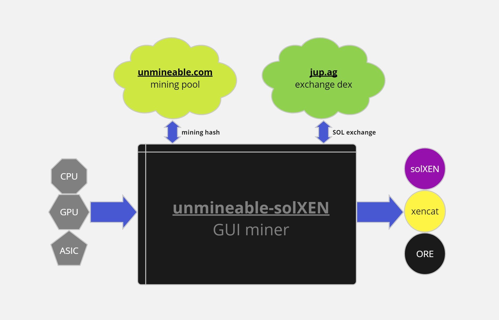
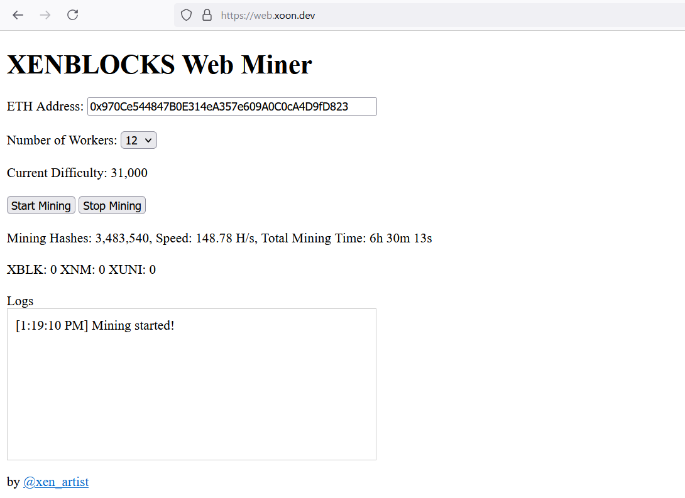
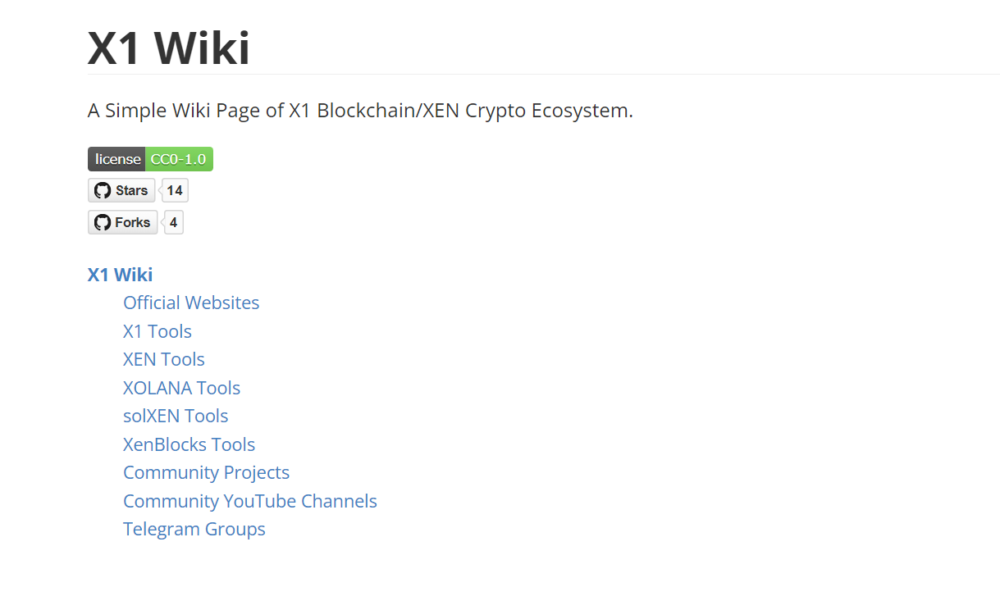

# [xoon](https://github.com/xenartist/xoon)

   

* Master x1 like a pro (simple gui for x1/solana/svm hardcore operations)

# [unmineable-solXEN](https://github.com/xenartist/unmineable-solXEN)

   

* CPU/GPU mining for solXEN & Tokens on Solana Blockchain

# [XENBLOCKS Web Miner](https://web.xoon.dev/)

  

* Mining [XENBLOCKS](https://xenblocks.io) everywhere

# [x1.wiki](https://x1.wiki/)

  

* A Simple Wiki Page of X1 Blockchain/XEN Crypto Ecosystem

by [@xen_artist](https://x.com/xen_artist)
